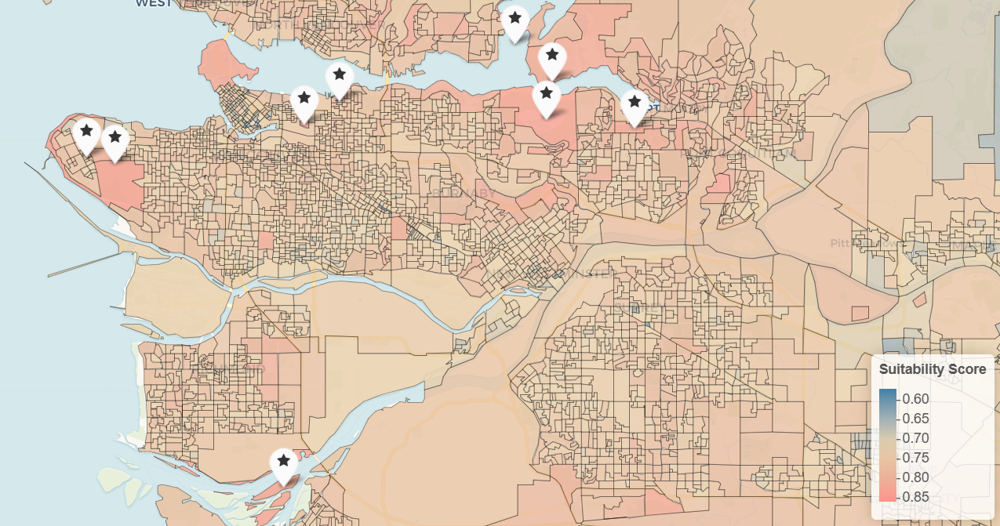
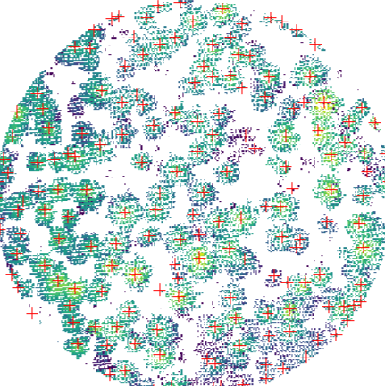
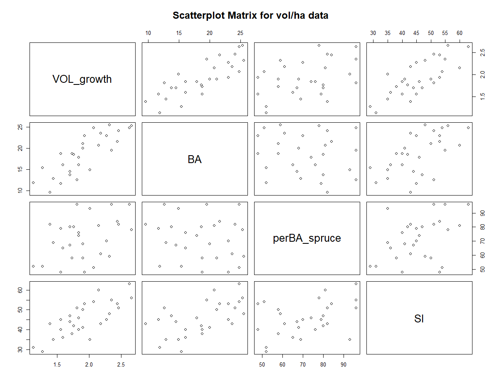

::: {.card-grid}

::: {.portfolio-card}

### [City Suitability Mapping](coursework_city_suitability.html)

Interactive suitability mapping for Metro Vancouver using customizable environmental, accessibility, and lifestyle factors.
:::

::: {.portfolio-card}

### [Individual Tree Detection with LiDAR](coursework_lidar.html)

LiDAR plot extraction, canopy height modelling, treetop detection, and individual tree crown segmentation.
:::

::: {.portfolio-card}

### [Multiple Linear Regression](coursework_mlr.html)

Statistical data analysis, regression modelling, diagnostics, and predictive analysis for forest growth estimation.
:::

:::

