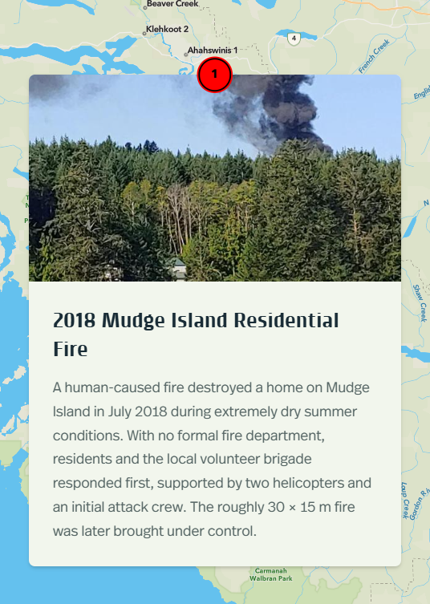
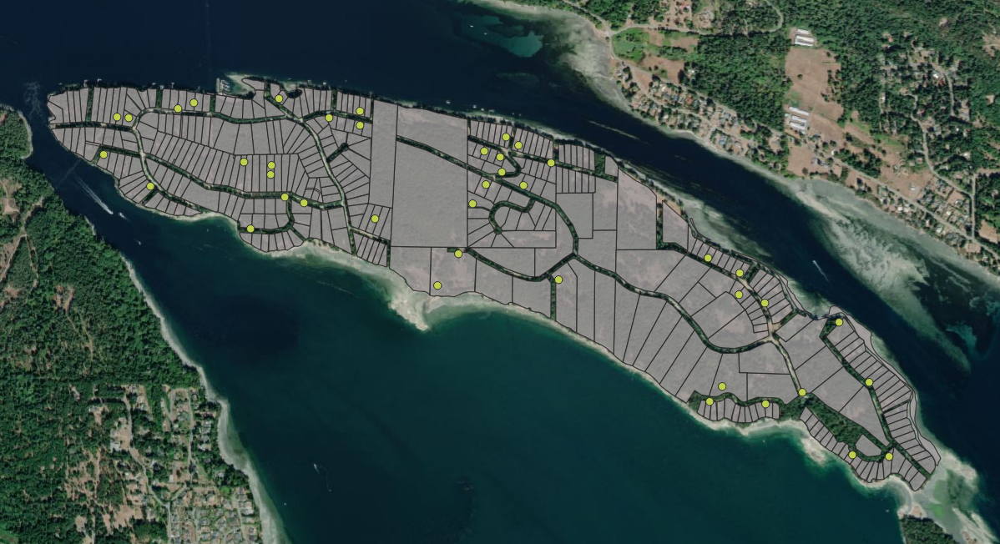
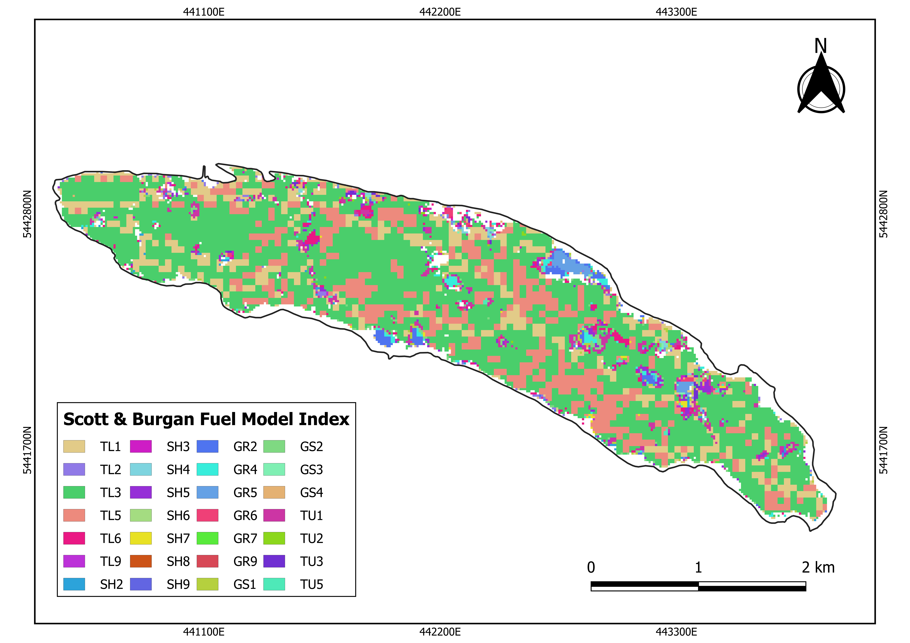

::: {.card-grid}

::: {.portfolio-card}

### [ArcGIS Storymaps - Mudge Island](projects_storymaps.html)

Landscape and wildfire environment overview of Mudge Island including climate, vegetation, land cover, and fuel types.
:::

::: {.portfolio-card}

### [Disaster Response Mapping](projects_disastermap.html)

Interactive emergency response map for Mudge Island showing water caches, evacuation routes, and key resources.
:::

::: {.portfolio-card}

### [Fuel type Mapping](projects_fuelmap.html)

Preliminary land cover map, biophysical features (AGB and aridity), refined fuel type map aligned with the Scott and Burgan (2005) classification system, and the five most common fuel types on Mudge Island.
:::

:::

