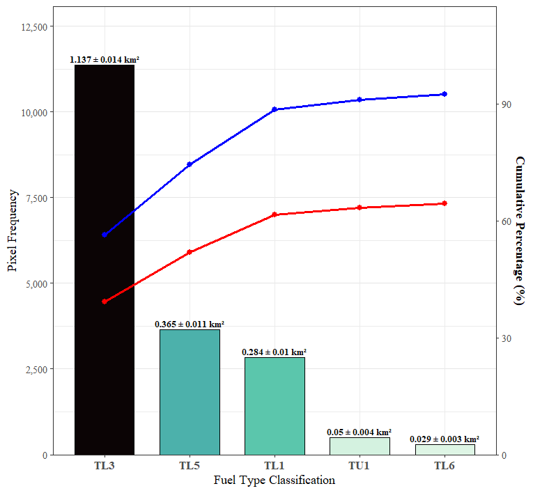

# 3 | Fuel type Mapping

## 3.1 | Preliminary Land Cover Map

In this project, I used a 15-band composite derived from 12 Sentinel-2 bands and 3 vegetation indices (NDVI, EVI, and NDWI) as a predictor and integrated four reference land cover maps (CCRS, CFS, VRI, and AAFC) into a high-confidence ground-truth map, where each class is agreed upon by at least three out of four sources. A 1D convolutional neural network (1D-CNN) classifies each pixel using its 15-band spectral profile. For each pixel, the model produces a probability score for every land-cover class and assigns the pixel to the class with the highest predicted probability, representing the model’s most likely classification.

```{r PFTM-leaflet, include = FALSE}
## --- Fix PROJ path in-session (no system changes) ----------------------------
## Run these BEFORE loading spatial packages (or at the top of your Quarto)
Sys.unsetenv("PROJ_LIB"); Sys.unsetenv("PROJ_DATA"); Sys.unsetenv("GDAL_DATA")

## Point to a modern PROJ install you actually have (pick ONE you have installed):
Sys.setenv(PROJ_LIB = "C:/Program Files/QGIS 3.34.15/share/proj")
# Sys.setenv(PROJ_LIB = "C:/OSGeo4W/share/proj")  # if you use OSGeo4W

# (Optional) some builds also expect GDAL_DATA:
if (dir.exists("C:/Program Files/QGIS 3.34.15/share/gdal")) {
  Sys.setenv(GDAL_DATA = "C:/Program Files/QGIS 3.34.15/share/gdal")
}

## --- Libraries ---------------------------------------------------------------
library(terra)
library(leaflet)

## --- Load raster -------------------------------------------------------------
r_path <- "Maps_Kelvin/Preliminary_FTM.tif"
stopifnot(file.exists(r_path))

Pre_FTM_raw <- rast(r_path)

## --- Ensure the raster has a real CRS (critical) -----------------------------
## If the file lacks a CRS tag, set the TRUE CRS of the data here.
## (Example uses BC Albers; change if your data is something else.)
if (is.na(crs(Pre_FTM_raw)) || crs(Pre_FTM_raw) == "") {
  crs(Pre_FTM_raw) <- "EPSG:3005"  # <-- CHANGE to your raster’s actual CRS if different
}

## --- Build palette / legend domain -------------------------------------------
vals <- unique(values(Pre_FTM_raw))
vals <- vals[!is.na(vals)]

fuel_labels <- c("Broadleaf","Conifer","Shrub","Grass","Bare Soil","Urban","Water")
fuel_colors <- c("#00FF00","#008000","#FF0000","#E69F00","#808080","#FFFFFF","#0000FF")

if (length(fuel_colors) < length(vals) || length(fuel_labels) < length(vals)) {
  warning("You have more classes in the raster than labels/colors supplied. ",
          "Some classes may be unlabeled/uncolored.")
}

pal <- colorFactor(
  palette  = fuel_colors,
  domain   = vals,
  na.color = "transparent"
)

## --- Map view defaults -------------------------------------------------------
mudge_lng <- -123.7910
mudge_lat <-  49.1290
zoom_lvl  <- 14

## --- Leaflet map -------------------------------------------------------------
Lea_01 <- leaflet() %>%
  addProviderTiles("Esri.WorldImagery") %>%
  setView(lng = mudge_lng, lat = mudge_lat, zoom = zoom_lvl) %>%
  addRasterImage(
    Pre_FTM_raw,
    colors  = pal,
    opacity = 0.8,
    project = TRUE,        # leaflet/terra reprojects to EPSG:3857
    method  = "ngb",       # categorical classes
    maxBytes = 16 * 1024^2
  ) %>%
  addLegend(
    pal    = pal,
    values = vals,
    title  = "Fuel Type",
    labFormat = labelFormat(transform = function(x) {
      idx <- suppressWarnings(as.integer(x))
      out <- rep(NA_character_, length(idx))
      ok  <- !is.na(idx) & idx >= 1 & idx <= length(fuel_labels)
      out[ok] <- fuel_labels[idx[ok]]
      out
    })
  ) %>%
  addScaleBar(position = "bottomleft")
```

```{r PFT-map, echo=FALSE}
Lea_01
```

## Code Snippets

::: {.panel-tabset group="language"}
## R

``` (.r)
library(terra)

# Compute per-pixel agreement count (1–4)
agree_count <- app(ref_stack, fun = function(x) {
  if (all(is.na(x))) return(NA)
  tab <- table(x)
  return(max(tab))
})

# Compute modal (most common) class value
agree_modal <- app(ref_stack, fun = function(x) {
  if (all(is.na(x))) return(NA)
  tab <- table(x)
  return(as.numeric(names(which.max(tab))))
})
```

## Python

``` (.python)
import numpy as np

def compute_agreement(ref_stack):
    bands, H, W = ref_stack.shape
    flat = ref_stack.reshape(bands, -1)

    agree_count = np.full(flat.shape[1], np.nan)
    agree_modal = np.full(flat.shape[1], np.nan)

    for i in range(flat.shape[1]):
        x = flat[:, i]
        x = x[~np.isnan(x)]
        if x.size == 0:
            continue

        vals, cnts = np.unique(x, return_counts=True)
        j = cnts.argmax()
        
        # Compute per-pixel agreement count (1–4)
        agree_count[i] = cnts[j]
        
        # Compute modal (most common) class value
        agree_modal[i] = vals[j]

    return agree_count.reshape(H, W), agree_modal.reshape(H, W)
```
:::

## 3.2 | Biophysical Inputs: Biomass & Dryness indices

I also integrated two biophysical features into my preliminary fuel type map. The above-ground tree biomass map was reclassified into three classes: low (0–150 tons/ha), medium (150–350 tons/ha), and high (\> 350 tons/ha) biomass. Sentinel-2 spectral bands (B03, BO8), topographic data (DEM, Slope), and PRISM climatic variables (MAT, MAP) were utilized to derive the dryness index and then reclassified into three fuel moisture classes: moist (0.00–0.30), moderate (0.30–0.60), and dry (0.60–1.00). Subsequently, I combined these two maps into a 9-class Biomass-Dryness (BD) Map.

```{r BDM-leaflet, include = FALSE}
library(terra)
library(leaflet)

## --- Load raster -------------------------------------------------------------
BDM_raw <- rast("Maps_Kelvin/Biomass_Dryness_Map.tif")

## --- Ensure the raster has its true CRS (critical) ---------------------------
## Replace EPSG:3005 with the actual CRS if different.
if (is.na(crs(BDM_raw)) || crs(BDM_raw) == "") {
  crs(BDM_raw) <- "EPSG:3005"   # <-- CHANGE if your data uses another CRS
}

## --- Prepare classes / palette / labels -------------------------------------
vals_01 <- unique(values(BDM_raw))
vals_01 <- vals_01[!is.na(vals_01)]

dryness_labels <- c(
  "Moderate-Low",
  "Moderate-Medium",
  "Moderate-High",
  "Dry-Low",
  "Dry-Medium",
  "Dry-High"
)

dryness_colors <- c(
  "#00FF00",
  "#008000",
  "#FF0000",
  "#FFFF00",
  "#7FFF00",
  "#D2691E"
)

codes <- sort(unique(vals_01))

if (length(codes) == 9 && all(codes %in% 1:9)) {
  pal_01 <- colorFactor(
    palette  = dryness_colors,
    domain   = codes,
    na.color = "transparent"
  )
  label_fn <- function(x) {
    idx <- suppressWarnings(as.integer(x))
    lab <- rep(NA_character_, length(idx))
    ok  <- !is.na(idx) & idx >= 1 & idx <= length(dryness_labels)
    lab[ok] <- dryness_labels[idx[ok]]
    lab
  }
} else {
  names(dryness_colors) <- as.character(codes)
  names(dryness_labels) <- as.character(codes)
  pal_01 <- colorFactor(
    palette  = unname(dryness_colors[as.character(codes)]),
    domain   = codes,
    na.color = "transparent"
  )
  label_fn <- function(x) dryness_labels[as.character(x)]
}

## --- Map camera --------------------------------------------------------------
mudge_lng <- -123.7910
mudge_lat <-  49.1290
zoom_lvl  <- 14

## --- Leaflet map (let Leaflet/terra project to EPSG:3857) --------------------
Lea_02 <- leaflet() %>%
  addProviderTiles("Esri.WorldImagery") %>%
  setView(lng = mudge_lng, lat = mudge_lat, zoom = zoom_lvl) %>%
  addRasterImage(
    BDM_raw,
    colors   = pal_01,
    opacity  = 0.8,
    project  = TRUE,     # <- reproject to Web Mercator on the fly
    method   = "ngb",    # <- categorical data
    maxBytes = 16 * 1024^2
  ) %>%
  addLegend(
    pal      = pal_01,
    values   = codes,
    title    = "Biomass‑Dryness",
    labFormat = labelFormat(transform = label_fn)
  ) %>%
  addScaleBar(position = "bottomleft")
```

```{r BD-map, echo=FALSE}
Lea_02
```

## Code Snippets

::: {.panel-tabset group="language"}
## R

``` (.r)
# Combine into Dryness Index (weights sum ≈ 1)
dryness <- (0.30 * mat_n) +
  (0.25 * slope_n) +
  (0.20 * map_n) +
  (0.15 * ndwi_n) +
  (0.10 * dem_n)

# Normalize to 0–1
dryness <- normalize(dryness)
```

## Python

``` (.python)
import numpy as np

# Combine into Dryness Index (same weights as R)
dryness = (
    0.30 * mat_n +
    0.25 * slope_n +
    0.20 * map_n +
    0.15 * ndwi_n +
    0.10 * dem_n
)

# Min–max normalization (terra::normalize equivalent)
min_val = np.nanmin(dryness)
max_val = np.nanmax(dryness)

dryness = (dryness - min_val) / (max_val - min_val)
```
:::

## 3.3 | Refined Fuel Type Map

The final fuel type map was generated by first filtering out unburnable areas, such as water and urban surfaces. Next, I employed CNN-based unmixing to identify specific vegetation patterns (e.g., Conifer (CF) & Broadleaf (BL)) and "mixed" classes (e.g., Grass-Shrub (GS) & Timber-Shrub-Grass (TSG)). This vegetation data was combined with a BD9 map, which classifies the landscape into nine categories based on biomass levels and dryness. Eventually, the decision matrix cross-references these two layers through a lookup table to assign each pixel a standardized fire behavior code from the Scott and Burgan (2005) system.

```{r FFTM-leaflet, include = FALSE}
library(terra)
library(leaflet)
library(htmltools)

## --- Load raster -------------------------------------------------------------
SB_raw <- rast("Maps_Kelvin/SB_FMI.tif")

## --- Ensure the raster has a true CRS (critical) -----------------------------
## Replace EPSG:3005 if your data uses a different CRS.
if (is.na(crs(SB_raw)) || crs(SB_raw) == "") {
  crs(SB_raw) <- "EPSG:3005"   # <-- CHANGE if your data uses another CRS
}

## --- Domain / codes ----------------------------------------------------------
vals_02  <- as.vector(values(SB_raw))
vals_02  <- vals_02[!is.na(vals_02)]
codes_01 <- sort(unique(vals_02))

## --- Labels and colors -------------------------------------------------------
final_fuel_labels <- c(
  "TL1","TL2","TL3","TL5","TL6","TL9",
  "SH2","SH3","SH4","SH5","SH6","SH7","SH8","SH9",
  "GR2","GR4","GR5","GR6","GR7","GR9",
  "GS1","GS2","GS3","GS4",
  "TU1","TU2","TU3","TU5"
)

final_fuel_colors <- c(
  "#D6C69A","#D6B27A","#4BE28C","#13A7E6","#E63946","#2C67E4",
  "#08B9E6","#D423E6","#80E3E6","#A642E6","#B1E68A","#F0C000",
  "#C16727","#3C67D6","#1F47D6","#5BD6E6","#23A7D6","#E63E4A",
  "#4CE64C","#D63F40","#D6C666","#A6E6A6","#A7E6C3","#D6C09A",
  "#C32ECF","#00A830","#4EDC5B","#52A7D6"
)

## If your raster values are **codes** that correspond 1:1 with the label/color order,
## we can build a named palette to keep mapping stable regardless of which codes appear.
## For example, if values are 1..28 and match the above order:
##   1->TL1, 2->TL2, ..., 28->TU5
## If your codes are *not* 1..28, adjust 'all_codes' accordingly.
all_codes <- seq_along(final_fuel_labels)       # 1..28 by default
stopifnot(length(all_codes) == length(final_fuel_labels),
          length(final_fuel_labels) == length(final_fuel_colors))

# Build named vectors for robust mapping
names(final_fuel_labels) <- as.character(all_codes)
names(final_fuel_colors) <- as.character(all_codes)

# Subset to the codes present in the raster, preserving names
present <- intersect(as.character(all_codes), as.character(codes_01))
pal_02 <- colorFactor(
  palette  = unname(final_fuel_colors[present]),
  domain   = as.numeric(present),
  na.color = "transparent"
)

## --- HTML legend (unchanged) -------------------------------------------------
legend_html_multi <- function(title, labels, colors, ncol = 3, font_size = 10) {
  stopifnot(length(labels) == length(colors))
  k <- length(labels)
  # Split indices into ncol roughly-equal groups
  cuts   <- ceiling(seq(0, k, length.out = ncol + 1))
  splits <- lapply(seq_len(ncol), function(j) (cuts[j] + 1):cuts[j + 1])

  make_col <- function(idx) {
    idx <- idx[!is.na(idx)]
    tags$ul(
      style = "list-style:none; padding:0 10px 0 0; margin:0;",
      lapply(idx, function(i) {
        tags$li(
          style = "display:flex; align-items:center; margin: 2px 0;",
          tags$span(style = paste0(
            "display:inline-block;width:10px;height:10px;",
            "border:1px solid #555;margin-right:6px;background:", colors[i], ";"
          )),
          tags$span(labels[i])
        )
      })
    )
  }

  tags$div(
    style = paste0(
      "background: rgba(255,255,255,0.92); padding:8px 10px; border-radius:4px; ",
      "box-shadow: 0 1px 4px rgba(0,0,0,0.3); ",
      "font-family: 'Helvetica Neue', Arial, Helvetica, sans-serif; ",
      "font-size:", font_size, "px; max-height: 280px; overflow-y:auto;"
    ),
    tags$div(style="font-weight:600; margin-bottom:6px;", title),
    tags$div(style = "display:flex; flex-direction:row;", lapply(splits, make_col))
  )
}

leg_html <- legend_html_multi(
  title  = "Final Fuel Type Map",
  labels = final_fuel_labels,
  colors = final_fuel_colors,
  ncol   = 3,
  font_size = 10
)

## --- Map view ----------------------------------------------------------------
mudge_lng <- -123.7910
mudge_lat <-  49.1290
zoom_lvl  <- 14

Lea_03 <- leaflet() %>%
  addProviderTiles("Esri.WorldImagery") %>%
  setView(lng = mudge_lng, lat = mudge_lat, zoom = zoom_lvl) %>%
  addRasterImage(
    SB_raw,
    colors   = pal_02,
    opacity  = 0.8,
    project  = TRUE,     # <- let Leaflet/terra project to EPSG:3857
    method   = "ngb",    # <- categorical data
    maxBytes = 16 * 1024^2
  ) %>%
  addControl(html = as.character(leg_html), position = "topright") %>%
  addScaleBar(position = "bottomleft")
```

```{r FFT-map, echo=FALSE}
Lea_03
```

## Code Snippets

::: {.panel-tabset group="language"}
## R

``` (.r)
# Build Lookup table
lookup <- list(
  
  BL = c("Dry-Low"=fuel_ids$TL2, "Dry-Medium"=fuel_ids$TL6, "Dry-High"=fuel_ids$TL9, "Moderate-Low"=fuel_ids$TL2, "Moderate-Medium"=fuel_ids$TL6, "Moderate-High"=fuel_ids$TL9, "Moist-Low"=fuel_ids$TL2, "Moist-Medium"=fuel_ids$TL6, "Moist-High"=fuel_ids$TL9),
  
  CF = c("Dry-Low"=fuel_ids$TL1, "Dry-Medium"=fuel_ids$TL3, "Dry-High"=fuel_ids$TL5, "Moderate-Low"=fuel_ids$TL1, "Moderate-Medium"=fuel_ids$TL3, "Moderate-High"=fuel_ids$TL5, "Moist-Low"=fuel_ids$TL1, "Moist-Medium"=fuel_ids$TL3, "Moist-High"=fuel_ids$TL5),
  
  SH = c("Dry-Low"=fuel_ids$SH2, "Dry-Medium"=fuel_ids$SH5, "Dry-High"=fuel_ids$SH7, "Moderate-Low"=fuel_ids$SH6, "Moderate-Medium"=fuel_ids$SH3, "Moderate-High"=fuel_ids$SH9, "Moist-Low"=fuel_ids$SH6, "Moist-Medium"=fuel_ids$SH3, "Moist-High"=fuel_ids$SH9),
  
  ...
```

## Python

``` (.python)
# Build Lookup table
lookup = {

    "BL": {"Dry-Low": fuel_ids["TL2"], "Dry-Medium": fuel_ids["TL6"], "Dry-High": fuel_ids["TL9"], "Moderate-Low": fuel_ids["TL2"], "Moderate-Medium": fuel_ids["TL6"], "Moderate-High": fuel_ids["TL9"], "Moist-Low": fuel_ids["TL2"], "Moist-Medium": fuel_ids["TL6"], "Moist-High": fuel_ids["TL9"]},

    "CF": {"Dry-Low": fuel_ids["TL1"], "Dry-Medium": fuel_ids["TL3"], "Dry-High": fuel_ids["TL5"], "Moderate-Low": fuel_ids["TL1"], "Moderate-Medium": fuel_ids["TL3"], "Moderate-High": fuel_ids["TL5"], "Moist-Low": fuel_ids["TL1"], "Moist-Medium": fuel_ids["TL3"], "Moist-High": fuel_ids["TL5"]},

    "SH": {"Dry-Low": fuel_ids["SH2"], "Dry-Medium": fuel_ids["SH5"], "Dry-High": fuel_ids["SH7"], "Moderate-Low": fuel_ids["SH6"], "Moderate-Medium": fuel_ids["SH3"], "Moderate-High": fuel_ids["SH9"], "Moist-Low": fuel_ids["SH6"], "Moist-Medium": fuel_ids["SH3"], "Moist-High": fuel_ids["SH9"]},
    
    ...
```
:::

## 3.4 | Top Five Fuel Types on Mudge Island

This chart shows the proportion of the five most common fuel types on Mudge Island. They are TL3 (Moderate Load Conifer Litter), TL5 (High Load Conifer Litter), TL1 (Low Load Compact Conifer Litter), TU1 (Low Load Dry Climate Timber–Grass–Shrub), and TL6 (Moderate Load Broadleaf Litter). These five fuel types occupied 64% of the island's total area (92% of the burnable vegetation area), equivalent to 1.9 km². Conifer-related fuel types (TL3, TL5, and TL1) accounted for 62% (1.8 km²) of the island's area. This is a large proportion, considering that the island’s total area is only 2.9 km².

{width=85% fig-align="center"}